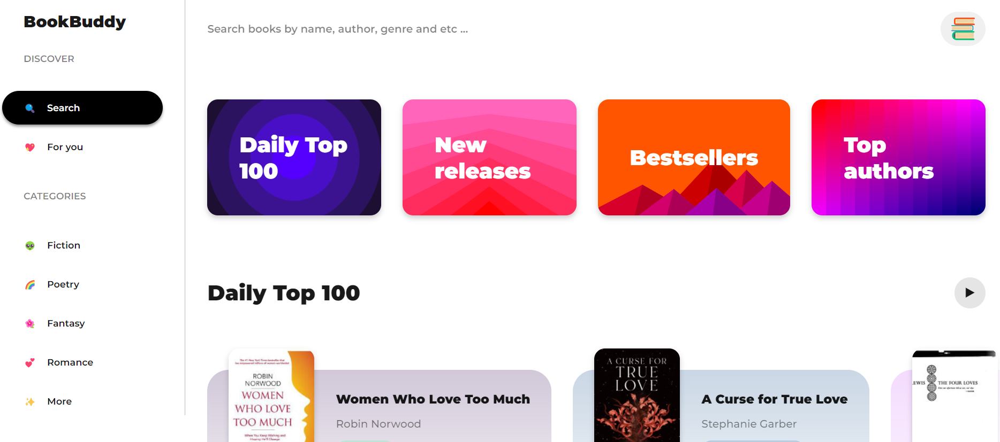
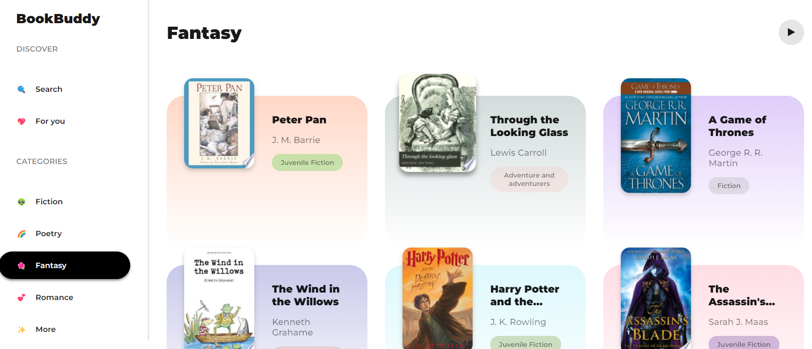
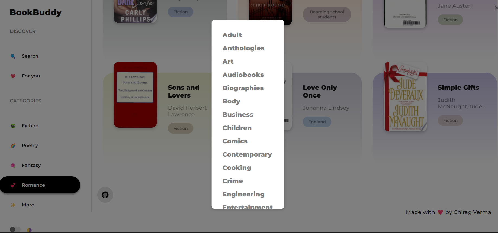
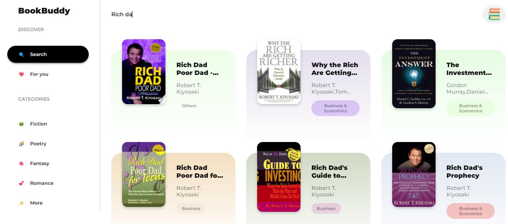
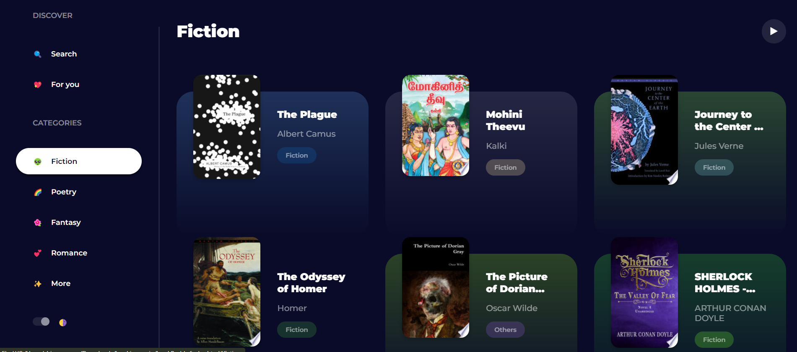

# BookBuddy: Find Books from Google Play Books

## Table of Contents
1. [About The Project](#about-the-project)
2. [Features](#features)
3. [Built With](#built-with)
4. [Getting Started](#getting-started)
5. [Usage](#usage)
6. [Screenshots](#screenshots)
7. [Challenges and Solutions](#challenges-and-solutions)
8. [Roadmap](#roadmap)
9. [Contributing](#contributing)
10. [Contact](#contact)
11. [Acknowledgments](#acknowledgments)

## About The Project
BookBoddy is a web application built using HTML, CSS, and JavaScript that allows users to search for books and provides digital book results from the Google Books API. Users can simply enter the title, author, or any relevant keyword of the book they want to find, and BookBuddy fetches the information from Google Books API to display relevant results.

## Features
BookBuddy stands out from other book search applications due to the following special features:

- Simple and intuitive user interface for easy navigation.
- Real-time search suggestions for faster book discovery.
- Integration with the Google Books API to access an extensive collection of digital books.
- Quick access to book details, ratings, and user reviews.
- Responsive design for seamless browsing on different devices.

## Built With
- HTML
- CSS
- JavaScript
- Google Books API

## Getting Started
- Download the code and run index.html file
- To view the project click on this link: https://book-buddy-liart.vercel.app/

## Usage
1. Open the BookBuddy web application.
2. Enter the title, author, or any relevant keyword of the book you want to search.
3. Click the search button.
4. BookBuddy will display the digital book results from the Google Books API.

## Screenshots
 

## Challenges and Solutions
During the development of BookBuddy, I faced a few challenges:
1. **Handling Asynchronous API Calls**: Fetching data from the Google Books API required asynchronous calls, which led to some issues in displaying the results properly. I overcame this challenge by using JavaScript `async/await` to handle asynchronous API calls effectively.

2. **Responsive Design**: Creating a responsive layout that looks good on various devices and screen sizes was a challenge. I tackled this by using CSS media queries to adjust the styles based on the screen size.

## Roadmap
The future plans for BookBuddy include the following enhancements:
- Implementing user accounts to save favorite books and reading lists.
- Adding additional filters and sorting options for search results.
- Integrating user reviews and ratings from other platforms.

## Contributing
Contributions are welcome! If you find any issues or want to add new features, please create a pull request. Your help is appreciated.

## Contact
For any queries or support, please feel free to contact me at [chiragverma00310@gmail.com](mailto:chiragverma00310@gmail.com).

## Acknowledgments
I would like to express our gratitude to the creators of the Google Books API and the developers of the technologies and libraries used in this project. Their valuable contributions have played a significant role in making the BookBuddy App possible.
